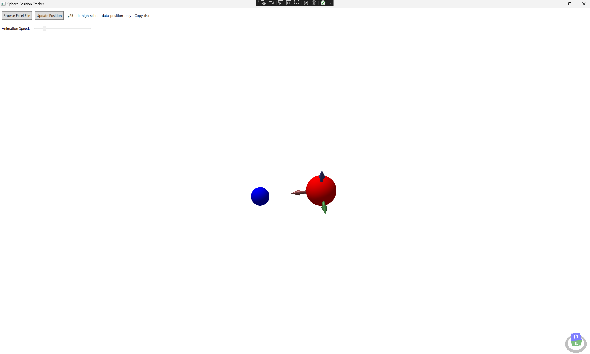

# NASA Rocket Position Data Visualization with .NET WPF XAML and Python

Overview This project is built using .NET WPF and XAML to visualize data provided by NASA. It is developed as part of the App Development Challenge (ADC), a coding competition that engages middle and high school students in solving real-world technical problems related to deep space exploration.

About the App Development Challenge The ADC is a NASA-hosted competition where students contribute to space exploration efforts, specifically the Artemis Generation mission. This initiative aims to return American astronauts to the Moon, including the first woman and the first person of color, while also laying the groundwork for future missions to Mars. By participating in the challenge, students play a direct role in shaping the future of space exploration.

Developed By Hutchinson Central Technical High School ICARUS Team
